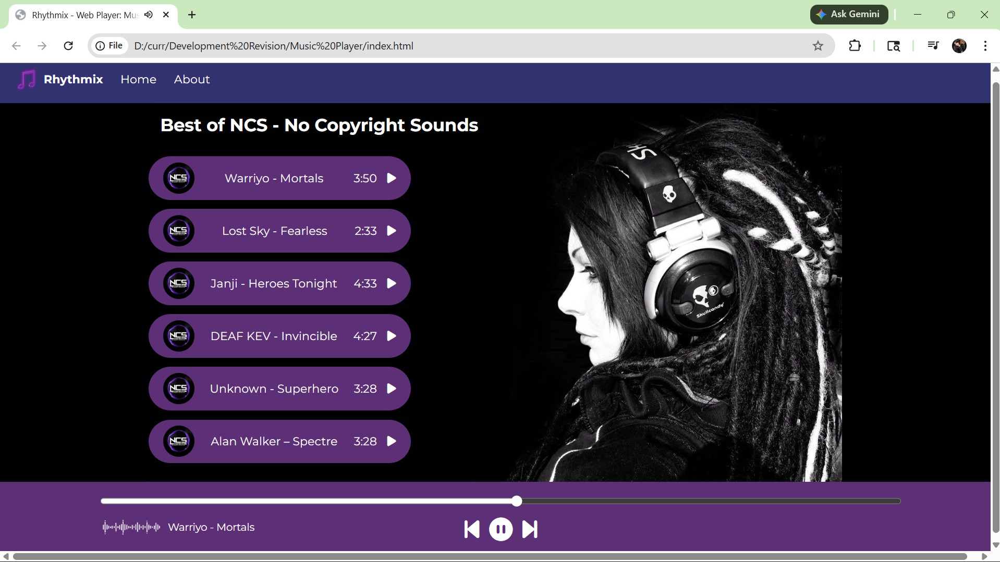

# Rhythmix 🎶
A lightweight JavaScript music player built with the HTML5 Audio API and vanilla JavaScript.

## ✨ Features
- **Dynamic Playlist**: Song names and durations are loaded automatically.
- **Play/Pause Toggle**: Master control with animated GIF feedback.
- **Progress Bar Sync**: Real-time progress tracking with seek functionality.
- **Individual Track Play**: Play any song directly from the playlist.
- **Next/Previous Controls**: Navigate seamlessly between tracks.
- **Auto-Play Next Song**: Automatically moves to the next track when one ends.

